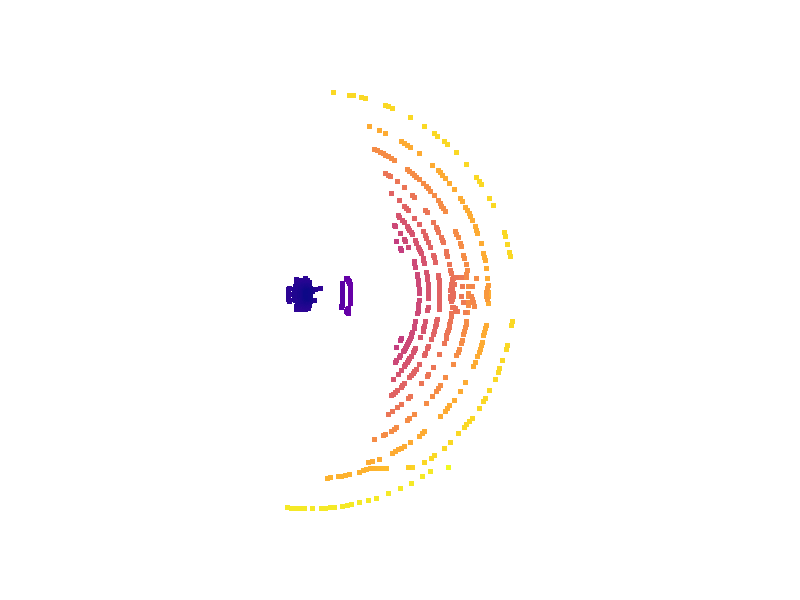
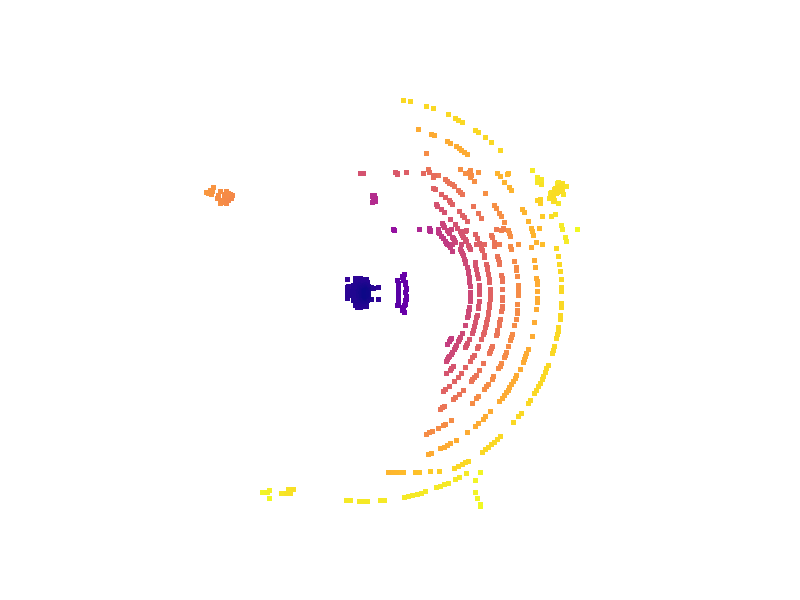

# CARLA ROS 2 Simulation

A simulation environment bridging **CARLA 0.9.16** and **ROS 2 Humble** for multimodal data extraction (Camera, LiDAR, IMU, GNSS) and autonomous vehicle testing.

---

## Architecture Overview

### Ego Vehicle

- Tesla Model 3 (`role_name: tesla_ego`)

### Leader Vehicle

- Lincoln MKZ 2020 (`role_name: leader`)
- Predefined 1km route waypoint navigation

### Sensors

- IMU
- GNSS
- Front Camera (RGB)
- Top LiDAR (32-Channel)

---

## Tested Environment/Prerequisites

| Component | Version |
|-----------|---------|
| Ubuntu | 22.04 |
| ROS 2 | Humble |
| CARLA | 0.9.16 |
| Python | 3.10 |
| Unreal Engine | CARLA Built-in |
| NumPy | 1.x |

---

## Package Overview

The core ROS 2 package in this repository is `carla_ros_sim`, which contains:
* **`vehicle_spawner` node:** Handles the spawning of the ego vehicle (Tesla Model 3), the leader vehicle (Lincoln MKZ), and attaches all multimodal sensors. Route management and autopilot logic are also managed here.
* **`lidar_headway_estimator` node:** Subscribes to the ego vehicle's LiDAR point cloud in real-time, applies bounding box filtering, and estimates the space headway to the leader vehicle.
* **Post-Processing Scripts:** A suite of Python tools to extract, synchronize, and visualize data from ROS bags into standard `.png`, `.csv` and `.pcd` formats.

---

## Installation & Workspace Setup

### 1. Setup the ROS 2 Workspace
Create a new workspace and clone the repository inside this directory:

```bash
mkdir -p ~/carla_simulation_ws
cd ~/carla_simulation_ws
git clone https://github.com/nsriad/carla_ros2_simulation.git
```

### 2. Install Python Dependencies
The post-processing and visualization scripts require specific Python libraries. You can install them globally or within your dedicated `carla_env` virtual environment:

```bash
pip install pandas numpy open3d rosbags matplotlib pillow
```

### 3. Build the Package
From the root of the cloned repository, build the package using `colcon`. Using the `--symlink-install` flag is recommended for Python packages so you do not have to rebuild every time you edit a script.

```
source /opt/ros/humble/setup.bash
colcon build --packages-select carla_ros_sim --symlink-install
```
Once built, source the local setup file so the ROS 2 CLI can find your package. You must do this in every new terminal before running the nodes:
```
source install/setup.bash
```

## Running the Simulation

The pipeline is designed to run across **5 terminals**.

### Terminal 1: Launch CARLA Server

Navigate to your CARLA installation directory and launch the simulation environment:

```bash
./CarlaUE4.sh
```
*Note: Append `-RenderOffScreen` for maximum performance during data collection, `-quality-level=Low` for testing with low memory usage, or `-quality-level=Epic` for maximum visual quality.*

---

### Terminal 2: Launch CARLA ROS Bridge

Navigate to your CARLA ROS bridge workspace and source its installation to make the launch files available. Then, launch the bridge (defaulted to 10 FPS for synchronized RGB and LiDAR data collection):

```bash
source ~/carla_ros_bridge/install/setup.bash

ros2 launch carla_ros_bridge carla_ros_bridge.launch.py \
town:=Town10HD_Opt \
timeout:=30 \
fixed_delta_seconds:=0.1
```

*Note: For smoother simulation when heavy sensor streams are disabled, adjust `fixed_delta_seconds` to `0.033` (30 FPS) or `0.016` (60 FPS).*

---

### Terminal 3: Launch Vehicle Spawner

First, activate the dedicated Python virtual environment. This environment isolates the CARLA Python API and specific package versions (like NumPy 1.x) required to prevent cv_bridge incompatibilities during image extraction.

```bash
source ~/carla_simulation_ws/carla_env/bin/activate
```

*Note: The system is configured so that ROS 2 continues to utilize the global, OS-level Python installation for its core execution and hardware interfacing, while drawing only the simulation-specific dependencies from this active virtual environment.*

Next, navigate to the local ROS 2 workspace, source it, and start the ego vehicle with its sensors:

```bash
cd ~/carla_simulation_ws
source install/setup.bash
ros2 run carla_ros_sim vehicle_spawner
```

---

### Terminal 4: Data Collection (ROS Bag)

To record synchronized multimodal sensor data, open a new terminal and run:

```bash
ros2 bag record -o "multimodal_dataset_$(date +%Y%m%d_%H%M%S)" \
/carla/tesla_ego/front_camera/image \
/carla/tesla_ego/top_lidar \
/carla/tesla_ego/imu_sensor \
/carla/tesla_ego/gnss_sensor
```

### Terminal 5: To plot rqt live plot

To plot linear acceleration in real-time:

```
ros2 run rqt_plot rqt_plot /carla/tesla_ego/imu_sensor/linear_acceleration/x
```
To plot your Latitude and Longitude moving in real-time:
```
ros2 run rqt_plot rqt_plot /carla/tesla_ego/gnss_sensor/latitude /carla/tesla_ego/gnss_sensor/longitude
```

---

## Data Post-Processing

Navigate to the following directory `cd data_analysis/` and run sensor-specific parser (for example: `python camera_parser.py`).

```
.
├── camera_parser.py
├── data
│   └── headway_log_new.csv
├── generate_cam_gif.py
├── headway_analysis.py
├── imu_gnss_parser.py
├── lidar_animator.py
├── lidar_parser.py
└── lidar_visualizer.py
```

Sensor data is extracted directly from the timestamped ROS bag folders. Python parsers generate camera frames as `.png` format, `.csv` files and Open3D point clouds `.pcd` directly into the run directory:

```text
data/
└── multimodal_dataset_YYYYMMDD_HHMMSS/
    ├── processed_camera/
    ├── processed_lidar/
    ├── processed_imu_gnss/
    └── processed_headway/
```

After the sensor-specific data extracted, then to visualize, you can run `generate_cam_gif.py`, `lidar_animator.py` or `lidar_visualizer.py`.

## Outputs & Data Visualization

The following visualizers demonstrate the synchronized multimodal data extracted from the ROS bag logs.

### Multimodal Sensor Grid
Demonstration of the ego vehicle navigating the cluttered town environment. The left column displays the front-facing RGB camera, and the right column displays the corresponding 32-channel LiDAR `PointCloud2` data (color-mapped for spatial distance).

| Scenario | Camera View | LiDAR Point Cloud |
| :---: | :---: | :---: |
| **Leader-<br>Follower<br>Tracking** |  |  |
| **Baseline<br>Navigation<br>(No&nbsp;Leader)** |  |  |

### IMU Sensor
Extracted linear acceleration data capturing the ego vehicle's longitudinal and lateral dynamics. <br>
[View the IMU Acceleration Plot (PDF)](asset/acceleration_plot.pdf)

---

## Development Notes and Troubleshooting

### NumPy 2.x and `cv_bridge` Compatibility

**Issue**

`cv_bridge` crashes due to incompatibilities with newer NumPy 2.x releases.

**Resolution**

Use a dedicated virtual environment (`carla_env`) with a NumPy 1.x version installed.

---

### CARLA 0.9.16 Version Rejection

**Issue**

The default `carla_ros_bridge` includes a version check that rejects CARLA releases newer than 0.9.13.

**Resolution**

Patch the bridge source code located at `~/carla_ros_bridge/src/ros-bridge/carla_ros_bridge/src/carla_ros_bridge/bridge.py` to bypass the version restriction and allow native support for CARLA 0.9.16. This code read the version from the file `CARLA_VERSION`, just edit the version here.

---

### Traffic Manager Port Conflicts

**Issue**

Previously terminated sessions may leave Traffic Manager processes attached to port `8000`, causing autopilot failures.

**Resolution**

Use a dedicated Traffic Manager port:

```python
client.get_trafficmanager(8051)
```

If conflicts remain:

```bash
killall -9 python3
```

or

```bash
sudo fuser -k 8051/tcp
```

---

### Spectator Camera Jitter and Desynchronization

**Issue**

ROS 2 timer callbacks may become unsynchronized from CARLA's physics engine, resulting in camera jitter.

**Resolution**

Bind spectator updates directly to the CARLA physics tick:

```python
self.world.on_tick(...)
```

This ensures smooth and physically synchronized camera tracking.

---

### Traffic Manager Route Divergence

**Issue**

When using autopilot for multiple vehicles in the same lane, the Traffic Manager may independently choose different routes at intersections, causing the ego vehicle to lose the leader.

**Resolution**

Predefine a specific route using waypoints and force both vehicles to follow it. Adjust the ego vehicle's `vehicle_percentage_speed_difference` to prevent it from overtaking the leader at traffic lights.

---

