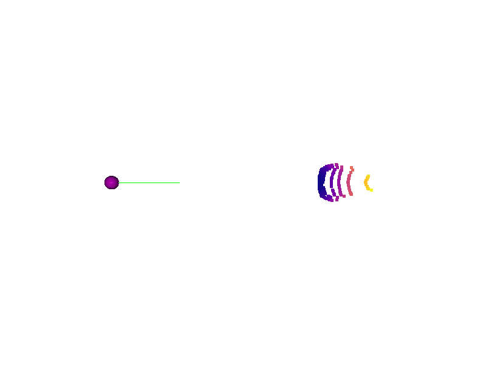
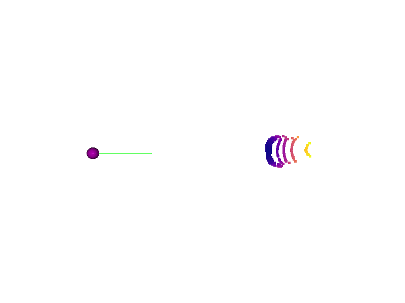
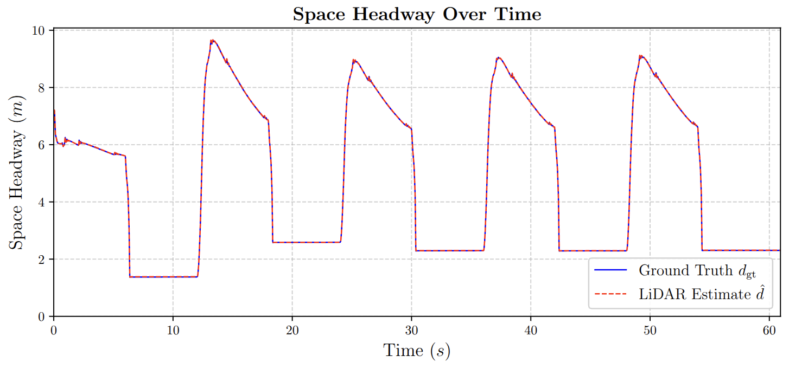
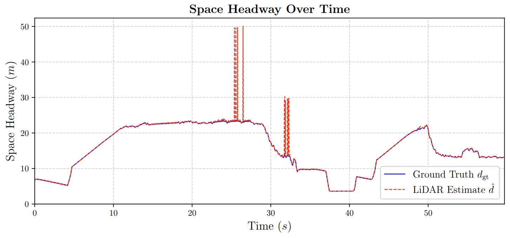

# CARLA ROS 2 Simulation

A simulation environment bridging **CARLA 0.9.16** and **ROS 2 Humble** for multimodal data extraction (Camera, LiDAR, IMU, GNSS) and autonomous vehicle testing.

---

## Architecture Overview

### Ego Vehicle

- Tesla Model 3 (`role_name: tesla_ego`)

### Leader Vehicle

- Lincoln MKZ 2020 (`role_name: leader`)
- Predefined 1km route waypoint navigation

### Sensors

- IMU
- GNSS
- Front Camera (RGB)
- Top LiDAR (32-Channel)

---

## Tested Environment/Prerequisites

| Component | Version |
|-----------|---------|
| Ubuntu | 22.04 |
| ROS 2 | Humble |
| CARLA | 0.9.16 |
| Python | 3.10 |
| Unreal Engine | CARLA Built-in |
| NumPy | 1.x |

---

## Package Overview

The core ROS 2 package is `carla_ros_sim`. The source is organized into modular files under `src/carla_ros_sim/carla_ros_sim/`:

| File | Description |
|---|---|
| `vehicle_spawner.py` | Main ROS 2 node. Connects to CARLA, spawns vehicles, attaches sensors, runs the control loop, and manages simulation lifetime via a configurable duration timer |
| `carla_env.py` | Environment class handling CARLA client connection, vehicle spawning, ground truth calculation, spectator camera, and Traffic Manager configuration for both custom and default map modes |
| `sensors.py` | Sensor attachment manager. Configures and spawns IMU, GNSS, RGB camera, and 32-channel LiDAR onto the ego vehicle |
| `controllers.py` | PID longitudinal controller for ego vehicle gap tracking, and stop-and-go wave logic for the leader vehicle on the custom straight road |
| `lidar_headway_estimator.py` | ROS 2 node that subscribes to the raw LiDAR point cloud, applies a 3D bounding box ROI filter, estimates space headway via radial distance, publishes both the scalar headway and the filtered ROI point cloud, and logs results to a timestamped CSV |

---

## Installation & Workspace Setup

### 1. Setup the ROS 2 Workspace
Create a new workspace and clone the repository inside this directory:

```bash
mkdir -p ~/carla_simulation_ws
cd ~/carla_simulation_ws
git clone https://github.com/nsriad/carla_ros2_simulation.git
```

### 2. Install Python Dependencies
The post-processing and visualization scripts require specific Python libraries. You can install them globally or within your dedicated `carla_env` virtual environment:

```bash
pip install pandas numpy open3d rosbags matplotlib pillow
```

### 3. Build the Package
From the root of the cloned repository, build the package using `colcon`. Using the `--symlink-install` flag is recommended for Python packages so you do not have to rebuild every time you edit a script.

```
source /opt/ros/humble/setup.bash
colcon build --packages-select carla_ros_sim --symlink-install
```
Once built, source the local setup file so the ROS 2 CLI can find your package. You must do this in every new terminal before running the nodes:
```
source install/setup.bash
```

## Running the Simulation

The pipeline is designed to run across **5 terminals**.

### Terminal 1: Launch CARLA Server

Navigate to your CARLA installation directory and launch the simulation environment:

```bash
./CarlaUE4.sh
```
*Note: Append `-RenderOffScreen` for maximum performance during data collection, `-quality-level=Low` for testing with low memory usage, or `-quality-level=Epic` for maximum visual quality.*

---

### Terminal 2: Launch CARLA ROS Bridge

Navigate to your CARLA ROS bridge workspace and source its installation to make the launch files available. Then, launch with either a default CARLA town or a custom OpenDRIVE map. (defaulted to 10 FPS for synchronized RGB and LiDAR data collection):

**Default CARLA town (e.g. Town04):**

```bash
source ~/carla_ros_bridge/install/setup.bash

ros2 launch carla_ros_bridge carla_ros_bridge.launch.py \
  town:=Town04 \
  timeout:=30 \
  fixed_delta_seconds:=0.1 \
  synchronous_mode:=True \
  use_sim_time:=True
```

**Custom straight highway map:**

```bash
ros2 launch carla_ros_bridge carla_ros_bridge.launch.py \
  town:=/home/ruby/Nazmus_Shakib/Summer_26/carla_simulation_ws/custom_maps/straight_highway.xodr \
  timeout:=30 \
  fixed_delta_seconds:=0.1 \
  synchronous_mode:=True
```

*Note: `synchronous_mode:=True` is required. Running asynchronously causes sensor frame desynchronization and data loss. For smoother simulation when heavy sensor streams are disabled, adjust `fixed_delta_seconds` to `0.033` (30 FPS) or `0.016` (60 FPS).*

---

### Terminal 3: Launch Vehicle Spawner

First, activate the dedicated Python virtual environment. This environment isolates the CARLA Python API and specific package versions (like NumPy 1.x) required to prevent cv_bridge incompatibilities during image extraction. Then launch everything with a single command:

```bash
source ~/carla_simulation_ws/carla_env/bin/activate
```

*Note: The system is configured so that ROS 2 continues to utilize the global, OS-level Python installation for its core execution and hardware interfacing, while drawing only the simulation-specific dependencies from this active virtual environment.*

Next, navigate to the local ROS 2 workspace, source it, and start the ego vehicle with its sensors:

```bash
cd ~/carla_simulation_ws
source install/setup.bash
ros2 launch carla_ros_sim sim_launch.py record:=true duration:=60
```

**Launch arguments:**

| Argument | Default | Description |
|---|---|---|
| `record` | `false` | Enable ROS bag recording |
| `duration` | `60` | Simulation duration in seconds. Set to `0` to run indefinitely |

The launch file starts three processes simultaneously: `vehicle_spawner`, `lidar_headway_estimator`, and the ROS bag recorder (when `record:=true`). The bag is saved to `data/multimodal_dataset_YYYYMMDD_HHMMSS/` automatically.

**To switch between custom map and default town mode**, change the following flag inside `vehicle_spawner.py` before building:

```python
self.env = CarlaEnvironment(use_custom_map=True)   # custom straight road
self.env = CarlaEnvironment(use_custom_map=False)  # default CARLA town
```

---

### Terminal 4: To plot rqt live plot

To plot linear acceleration in real-time:

```
ros2 run rqt_plot rqt_plot /carla/tesla_ego/imu_sensor/linear_acceleration/x
```
To plot your Latitude and Longitude moving in real-time:
```
ros2 run rqt_plot rqt_plot /carla/tesla_ego/gnss_sensor/latitude /carla/tesla_ego/gnss_sensor/longitude
```

---

## Data Post-Processing

Navigate to `data_analysis/` and run the pipeline shell scripts.

### Pipeline Scripts

| Script | Description |
|---|---|
| `parse_data.sh` | Extracts camera frames, LiDAR point clouds and IMU/GNSS data from the ROS bag into structured output directories |
| `post_process.sh` | Generates camera GIF, LiDAR timelapse animation, and headway plots from the parsed data |
| `camera_process.sh` | Runs the full camera pipeline: YOLO detection → missing/multi-vehicle frame checks → ZoeDepth estimation → calibration |
| `run_all.sh` | Master script, runs all three of the above in order for one dataset |

### Quick Start: Full Pipeline

```bash
cd data_analysis/

./run_all.sh 20260617_103550
```

This runs `parse_data.sh`, `post_process.sh`, `camera_process.sh`, then `headway_analysis.py`, in order, for one dataset. The datetime argument matches the folder name suffix: `multimodal_dataset_20260617_103550`.

### Running Steps Individually

Each stage can also be run on its own, useful when debugging one step without
re-running everything:

```bash
# step 1: extract all sensor data from bag
./parse_data.sh 20260617_103550

# step 2: generate visualizations
./post_process.sh 20260617_103550

# step 3: camera detection, depth estimation, and calibration
./camera_process.sh 20260617_103550

# step 4: final LiDAR vs camera vs ground truth comparison plots
python3 headway_analysis.py 20260617_103550
```

### Skipping Steps

Both `run_all.sh` and `camera_process.sh` accept skip flags, so you can re-run
just the step you're actively debugging instead of the whole pipeline:

```bash
# only re-run calibration, skip everything before it
./camera_process.sh 20260617_103550 --skip-yolo --skip-missing --skip-multi --skip-depth

# only re-run the camera pipeline, skip parsing and post-processing
./run_all.sh 20260617_103550 --skip-parse --skip-post --camera-args="--skip-yolo"
```

Output from `camera_process.sh` (including console output from the diagnostic
scripts, which would otherwise scroll past and be lost) is also saved to
`../data/reports/report_20260617_103550.txt` for later reference.

---

## YOLOv8 Vehicle Detection on CARLA Frames

Pipeline order: `yolo_detection.py` → `camera_headway_estimation.py` → `camera_calibrate.py`

```bash
# install dependencies
bash setup.sh

# run detections on your CARLA frames
python3 camera/yolo_detection.py \
  --frames_dir ../data/town04_leader_50_multimodal_dataset_20260618_102918/processed_camera/images \
  --conf_thresh 0.3 \
  --exclude_bottom_px 40
```

### Key Flags

| Flag | Description |
|---|---|
| `--conf_thresh` | YOLO detection confidence threshold (default: 0.30) |
| `--exclude_bottom_px` | Masks out this many pixels from the bottom of each frame before detection, to exclude the ego vehicle's own hood/bumper from being misdetected as a second vehicle. Check a few annotated images to pick the right value — the excluded region is shaded red in the output. Default: 0 (no masking) |
| `--num_frames` | Number of frames to sample evenly across the sequence. Omit to run on all frames |
| `--model` | YOLOv8 model variant (see table below) |

### Model Options

| Model       | Speed     | Accuracy | When to use                    |
|-------------|-----------|----------|--------------------------------|
| `yolov8n.pt`| ~5ms/img  | Good     | Default, fast iteration        |
| `yolov8s.pt`| ~10ms/img | Better   | If nano misses some vehicles   |
| `yolov8m.pt`| ~25ms/img | Best     | Final results for the paper    |

Switch with `--model yolov8s.pt`.

### Diagnostic Scripts

| Script | Description |
|---|---|
| `camera/find_multi_car_frame.py` | Flags frames where YOLO detected more than one vehicle, for reviewing duplicate/false-positive detections |
| `camera/missing_leader_frame.py` | Flags frames with no valid leader-vehicle detection (below confidence threshold or occluded) |

### Output schema (detections.csv)

| Column                | Description                                      |
|-----------------------|--------------------------------------------------|
| `frame`               | Filename                                         |
| `class`               | car / truck / bus / motorcycle                   |
| `confidence`          | Detection confidence [0, 1]                      |
| `bbox_bottom_center_x`| Horizontal center of box bottom edge             |
| `bbox_bottom_center_y`| Vertical position of box bottom (ground contact) |

---

## Depth Estimation with ZoeDepth

This project uses the official ZoeDepth models loaded via PyTorch Hub. Depending on the environment, different model weights can be loaded:

* **`ZoeD_K` (Default):** Trained on the KITTI dataset. Highly tuned for outdoor scenes and dashboard camera views. This is the default setting for our CARLA simulation pipeline.
* **`ZoeD_N`:** Trained on the NYU-Depth-V2 dataset. Tuned specifically for indoor environments.
* **`ZoeD_NK`:** A multi-headed model jointly trained on both NYU and KITTI datasets, capable of handling both indoor and outdoor domains.

By default, the script loads `ZoeD_K` for optimal outdoor structural estimation:
```python
zoe = torch.hub.load("isl-org/ZoeDepth", "ZoeD_K", pretrained=True, trust_repo=True).to(device).eval()

Run the following script:

```bash
python3 camera/camera_headway_estimation.py \
  --camera_dir ../data/town04_leader_50_multimodal_dataset_20260618_102918/processed_camera
```

This uses `detections.csv` and produces a raw (uncalibrated) metric depth estimate per frame. To calibrate further and get a reliable depth estimate, run:

```bash
python3 camera/camera_calibrate.py \
  --gt_csv ../data/headway_csv/headway_log_20260618_102918.csv \
  --cam_dir ../data/town04_leader_50_multimodal_dataset_20260618_102918/processed_camera \
  --gt_time_col timestamp \
  --gt_dist_col gt_headway_m
```

---

## Sensor Fusion

Located in `fusion/`. Combines calibrated camera and LiDAR headway estimates into
a single fused estimate, using a shared time-block train/test split (first half
of the drive trains, second half evaluates) rather than a random shuffle, since
consecutive frames are temporally correlated.

| Script | Method |
|---|---|
| `fusion/least_squares_fusion.py` | Linear fusion, `d_fused = θ0 + θ1·lidar + θ2·camera`, fit by ordinary least squares |
| `fusion/train_mlp_fusion.py` | Small MLP fusion (inputs: lidar, camera, `\|lidar - camera\|`), selectable MSE or Huber loss via `--loss` |
| `fusion/plot_fusion_comparison.py` | Combined comparison plots across all methods, reads from the shared results file |

**Usage:**

```bash
python3 fusion/least_squares_fusion.py \
  --merged_csv ../data/multimodal_dataset_20260713_191320/merged_cam_lid_gt.csv

python3 fusion/train_mlp_fusion.py \
  --merged_csv ../data/multimodal_dataset_20260713_191320/merged_cam_lid_gt.csv \
  --loss mse

python3 fusion/plot_fusion_comparison.py \
  --comparison_csv ../data/multimodal_dataset_20260713_191320/processed_fusion/fusion_comparison.csv \
  --zoom_start 120 --zoom_end 128
```

Every fusion script writes into a shared `processed_fusion/fusion_comparison.csv`,
appending its own prediction column (`least_squares_fused`, `mlp_mse_fused`,
`mlp_huber_fused`) rather than each script producing a separate output file, so
one plotting script can compare all methods at once.

---

## Outputs & Data Visualization

The following visualizers demonstrate the synchronized multimodal data extracted from the ROS bag logs.

### Multimodal Sensor Grid

Demonstration of the ego vehicle navigating the cluttered town environment. The left column displays the front-facing RGB camera, and the right column displays the corresponding 32-channel LiDAR `PointCloud2` data (color-mapped for spatial distance).

| Scenario | Camera View | LiDAR Point Cloud |
| :---: | :---: | :---: |
| **Leader-FollowerTracking** |  |  |
| **Baseline Navigation (No Leader)** |  |  |

### ROI-Filtered LiDAR Point Cloud

After applying the 3D bounding box ROI filter, only points belonging to the leader vehicle's rear face are retained. The ego vehicle origin is marked as a fixed reference point (white sphere) with a green arrow indicating the forward direction. Point color encodes radial distance from the ego sensor origin using the plasma colormap (blue = close, yellow = far).

| Scenario | Camera View | ROI LiDAR Point Cloud |
| :---: | :---: | :---: |
| **Custom Straight Road** |  |  |
| **Town04 Highway** |  |  |

### Space Headway Validation

LiDAR-estimated space headway compared against CARLA ground truth for both environments.

| Scenario | Headway Plot |
| :---: | :---: |
| **Custom Straight Road** |  |
| **Town04 Highway** |  |

### IMU Sensor

Extracted linear acceleration data capturing the ego vehicle's longitudinal and lateral dynamics.

[View the IMU Acceleration Plot (PDF)](asset/acceleration_plot.pdf)

---

## Troubleshooting

For known issues and their resolutions, see [troubleshooting.md](troubleshooting.md).